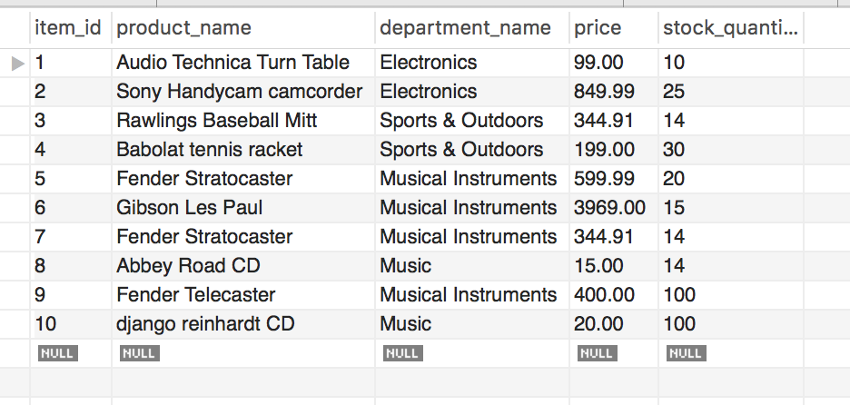
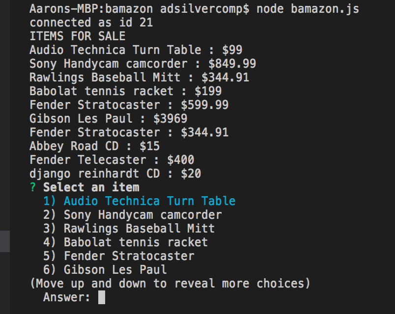
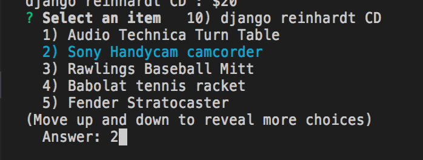
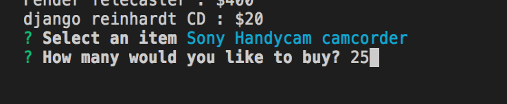
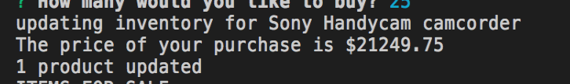
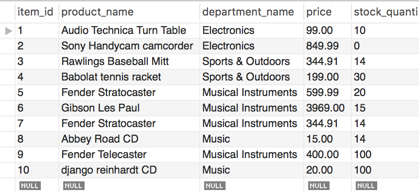
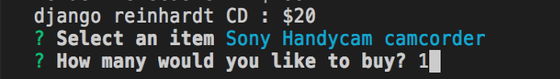
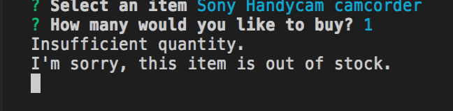

# bamazon

**Project Description**

*The Bamazon app utilizes node.Js and the inquirer node package to read & update  a MySQL database of products based on a customer's input.*
*The application is designed to complete a customer's order only if there are enough items in the database to do so.*

**MySQL Product Table**

**Command Line Interface**

*The user is presented with all of the items for sale as well as their price and is asked to select one of the items.*

*Once the user chooses an item, they are prompted for the quantity that they would like to purchase.*

*Once the user chooses the amount of the item they would like to purchase, they are presented with the total price, if there are enough items in stock.*

**Updated MySQL Product Table**

*After the user's purchase, the Database is updated.*

**Command Line Interface**

*If the user tries to purchase an out of stock item, they will be told that the item is out of stock.*

